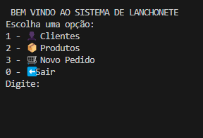
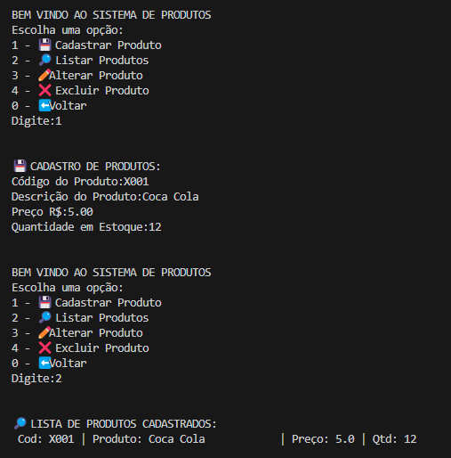
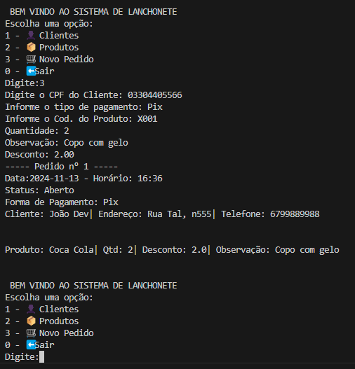
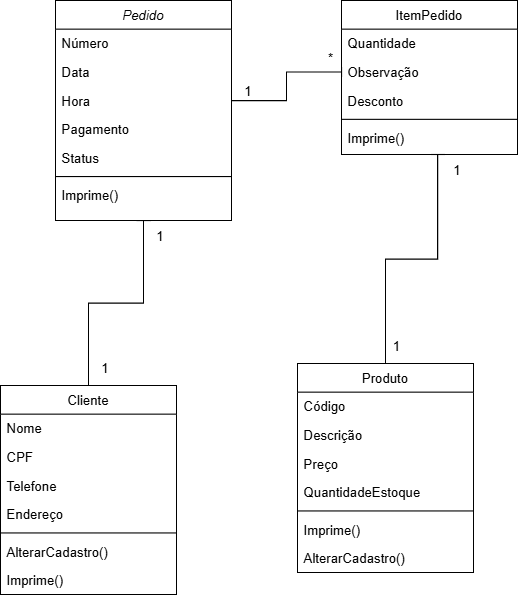

# Como Executar o Código em Python

Este repositório contém um código em Python que demonstra o uso de **Orientação a Objetos** (OO). Siga as instruções abaixo para executar o código.

## Pré-Requisitos

Antes de executar o código, certifique-se de ter o Python instalado. Se você ainda não tem, baixe e instale a versão mais recente do Python [aqui](https://www.python.org/downloads/).

### Instalar Dependências
Este programa não possuí dependencias

# Utilizando o sistema
Este código simula um sistema de lanchonete com cadastro de clientes, produtos e registro de pedidos.  

Para realizar um pedido é preciso cadastrar um cliente e um produto. 

No lançamento do pedido é preciso informar o CPF do cliente informado anteriormente e o código do produto cadastrado.  

# Diagrama de Classes 
Abrir arquivo "Diagrama de Classes.drawio" em [draw.io](https://www.draw.io/)  
  
